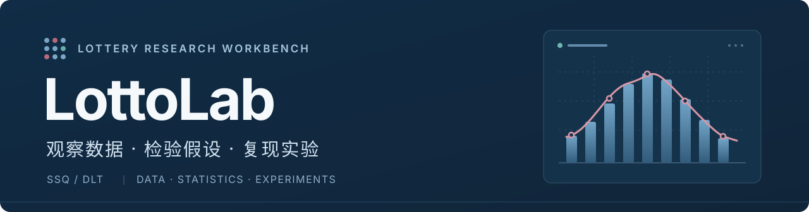
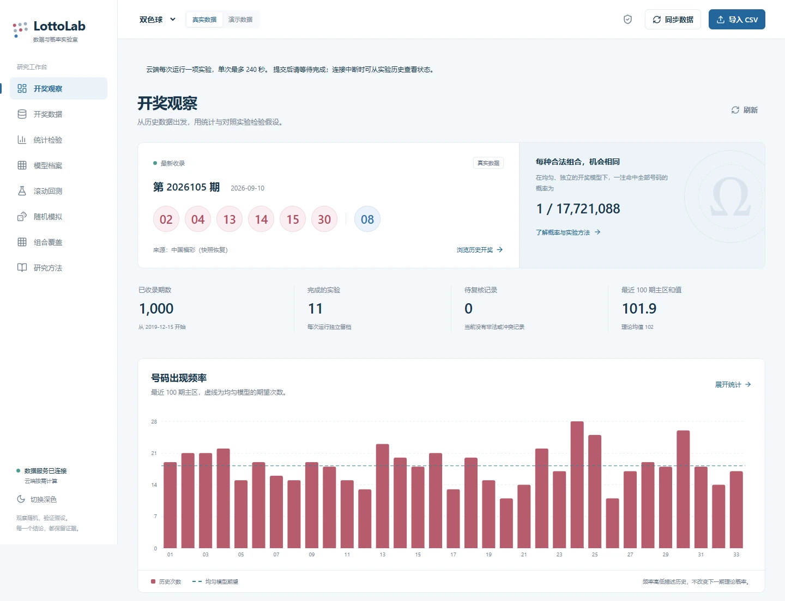
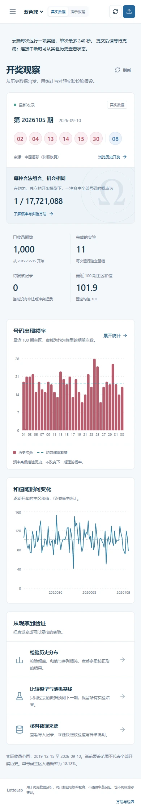
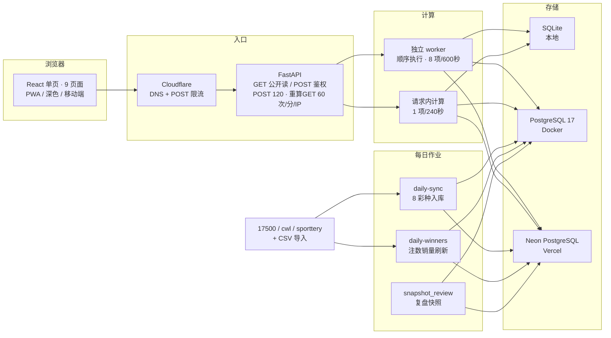

<p align="center">
  
</p>

<p align="center">
  <a href="https://github.com/LeilaoMi/LottoLab/actions/workflows/ci.yml"></a>
  <a href="https://github.com/LeilaoMi/LottoLab/releases"></a>
  <a href="LICENSE"></a>
  
</p>

<p align="center">
  <a href="docs/getting-started.md">安装</a> ·
  <a href="docs/user-guide.md">使用指南</a> ·
  <a href="docs/deployment.md">部署</a> ·
  <a href="docs/methodology.md">研究方法</a> ·
  <a href="CONTRIBUTING.md">参与贡献</a>
</p>

**LottoLab 是一个中文彩票数据研究工作台。** 它的三条立场：

- **真数据**：8 个彩种的开奖、销量与一等奖注数每日自动同步，多源交叉校验，不一致的期号拒绝入库；
- **诚实统计**：每个结论对照随机基线 + 显著性检验，被证伪的功能照样留档，而不是悄悄删掉；
- **可复现**：实验冻结数据、记录种子与代码指纹，逐期结果可导出 JSON 复核。

## 界面预览

[](docs/assets/workbench.webp)

[](docs/assets/demo.gif)

<p align="center"><sub>线上实例实拍（2026-09-21）。截图中的期数与结果来自该实例，仓库不附带历史数据库。</sub></p>

<details>
<summary>查看移动端界面</summary>
<p align="center">
  
</p>
</details>

## 彩种覆盖

| 彩种 | 规则 | 研究深度 |
| :--- | :--- | :--- |
| 双色球 SSQ | 红 6/33 + 蓝 1/16 | 完整：统计检验、四模型回测、模拟、覆盖、冷门度、ROI |
| 大乐透 DLT | 前 5/35 + 后 2/12 | 完整：统计检验、四模型回测、模拟、覆盖、历史 ROI（奖级版本化） |
| 七乐彩 QLC | 基本 7/30 + 特别号 | 统计检验、回测、模拟、覆盖 |
| 快乐8 KL8 | 20/80 | 统计检验、回测、模拟（全空间覆盖不实际，不做） |
| 福彩3D | 3 位 0–9 | 逐位频率/遗漏 + 逐位均匀性卡方 |
| 排列3 | 3 位 0–9 | 同上 |
| 排列5 | 5 位 0–9 | 同上 |
| 七星彩 | 前 6 位 0–9 + 第 7 位 0–14 | 同上 |

## 功能一览

**数据整理**：8 彩种多源同步（17500/cwl/sporttery 交叉比对）、CSV 导入导出（单次 1 万行，本地 8 MiB / 云端 4 MiB）、原始快照（本地文件 / 云端压缩入库）、重复校验与冲突复核；开奖每日自动同步（北京时间 23:00），一等奖注数与销量每日刷新（23:40）。

**历史观察与检验**：池型看号码频率、遗漏、和值、跨度、奇偶、分区、连号、重号与共现；数字型看逐位频率与遗漏。池型用无放回零模型 + Monte Carlo + 序列相关 + 多重比较校正；数字型用逐位均匀性卡方。

**模型与回测**：均匀随机、历史频率、逻辑回归、梯度提升树共用时间回测协议，主指标为逐号码平均二元 Brier，配对差值用循环块 bootstrap + Bonferroni 校正。实验保存参数、种子、冻结数据、逐期结果和代码指纹，支持 JSON 导出。

**在线工具**：7 策略推荐（稳健·热号 / 进取·遗漏 / 冷热均衡 / 区间覆盖 / 冷热加权 / 随机基准 / 冷门避撞，数字型 5 策略）+ 结构分 + 实测撞号指数 + 双色球冷门度（预计同奖人数与因子分解）；单式/复式/胆拖注数、批量验奖（单次 200 注×10 期，GET 只读端点公开可用）、票面 CSV 导出、策略回测、预测复盘闭环（推荐落台账→开奖自动对账）。

**统计诚实**：独立性检验为 null；冷门度只对浮动奖有意义，且仅双色球有样本外验证的系数（大乐透/七乐彩拟合后样本外不成立、不发布）；一切只描述历史、不改变中奖概率。拟合函数（销量协变量 + 70/30 时序验证 + 安慰剂闸门）与全部中间结论可复现。

界面提供深色主题和移动端布局，共 9 个页面：开奖观察、在线工具、开奖数据、统计检验、模型档案、滚动回测、随机模拟、组合覆盖、研究方法。真实数据与演示数据分开显示（演示期号以 `SIM-` 开头），数据来源、计算状态和实验限制随结果保留。

## 实盘记录（快照，非承诺）

每天同步后自动为双色球/大乐透登记推荐台账，开奖后自动对账。以下为线上实例快照（更新至 2026-09-24，台账持续累积，最新以站内“在线工具 → 预测复盘”为准）：

| 指标 | 数值 |
| :--- | :--- |
| 双色球 台账 / 已对账 | 21 条 / 14 条 |
| 双色球 平均命中（主区） | 1.000（随机期望 1.091） |
| 大乐透 台账 / 已对账 | 28 条 / 14 条 |
| 大乐透 平均命中（主区） | 1.000（随机期望 0.714） |
| 中奖 | 5 次（双色球 2、大乐透 3） |

样本尚小（各 n=14），平均命中贴近随机期望属于预期；这正是台账存在的意义：自证，不美化。

## 架构



本地/Docker 走独立 worker，Vercel 走请求内计算；快照本地存文件、云端压缩入库。实验一律冻结数据并记录种子与代码指纹。

## 快速开始

使用 Docker Compose 启动完整服务。需要 **Git、Python 3.12、Docker 和 Compose v2**；前端依赖会在镜像内构建。

```bash
git clone https://github.com/LeilaoMi/LottoLab.git
cd LottoLab
python scripts/bootstrap_env.py
docker compose up -d --build --wait
```

打开 **[http://127.0.0.1:18080](http://127.0.0.1:18080)**，在“管理权限”中输入本地生成的 `.env` 内的 `LOTTOLAB_ADMIN_TOKEN`，即可同步数据、导入 CSV 和运行实验。

首次启动为空数据库；通过页面“同步数据”或“导入 CSV”建立数据集（离线体验可用 `demo` 模式生成合成数据）。日常停止使用 `docker compose down`，数据保存在命名卷中。

不使用 Docker 时，按 **[本地安装指南](docs/getting-started.md)** 安装 Python 与前端依赖（Node.js 24 + pnpm 11.19.0），Windows 可通过 `Start-LottoLab.cmd` 启动。

## 访问与权限

| 环境 | 查询与推荐/验奖 | 同步、导入与计算 |
| :--- | :--- | :--- |
| 本地 / Docker | 可直接使用 | 仅本机访问，或凭 `LOTTOLAB_ADMIN_TOKEN` |
| Vercel 未设令牌 | 公开可访问 | 公开可访问（无需登录） |
| Vercel 已设令牌（≥32 位） | 公开可访问 | 需管理员令牌 |

当前系统没有注册、独立用户账户或角色管理。源码中没有预置任何公共账号或线上地址；自行部署即可获得独立的数据与实验空间。

## 运行与部署

| 方式 | 默认数据库 | 适用场景 |
| :--- | :--- | :--- |
| 本地 | SQLite | 个人分析与开发 |
| Docker | PostgreSQL 17 | 自托管与较长实验 |
| Vercel | Neon PostgreSQL | 个人云端使用 |

本地与 Docker 使用独立 worker（排队与运行合计最多 8 项，单项默认 600 秒）；云端按请求计算（最多 1 项、240 秒），电脑关机后仍可访问。Vercel Hobby 与 Neon Free 可用于符合其条款及配额的个人部署；具体额度以服务商为准。Cloudflare 可选用于自有域名的 DNS 与请求限流。

部署配置、独立预览环境、备份与恢复见 **[部署指南](docs/deployment.md)**。

## 质量门禁

每次推送与 PR 自动运行三条流水：后端（PostgreSQL 17 真库回归）、浏览器（Playwright 本地与云端两种模式）、容器（构建→灌数据→重建→校验数据与快照保留）。后端门禁为 `pip check`、Ruff 检查与格式、`mypy`、201 项 pytest（需 PostgreSQL 的 2 项在 CI 真库跑）；前端门禁为 Prettier 与构建。文档改动需核对命令、链接与真实渲染。

## 文档导航

| 文档 | 内容 |
| :--- | :--- |
| [安装启动](docs/getting-started.md) | 本地与 Docker 的安装、启动和首次导入 |
| [使用指南](docs/user-guide.md) | 权限、数据同步、CSV 格式与实验流程 |
| [API 速览](docs/api.md) | 端点、参数、鉴权与限流 |
| [部署指南](docs/deployment.md) | Vercel + Neon、自托管、备份和更新 |
| [研究方法](docs/methodology.md) | 零模型、时间切分、评价指标与边界 |
| [贡献指南](CONTRIBUTING.md) | 源码结构、开发环境与验证 |
| [变更记录](CHANGELOG.md) | 已发布版本的功能变化 |

## 使用边界

- 数据每日自动同步、一等奖注数/销量每日刷新；公开来源可能因地区限制暂不可用，此时可手动同步或导入 CSV。
- 频率、“冷热”和冷门度只描述历史样本与分奖人数；模型输出、覆盖与推荐结果都不代表已证明的预测优势，也不改变中奖概率。
- 冷门度只对浮动奖有意义，且仅双色球有样本外验证的系数（大乐透/七乐彩经拟合验证不成立、不发布）；固定奖玩法中了为定额、无人分摊，冷门度对期望为 0。
- SSQ 与 DLT 的历史 ROI 仅在奖金资料完整、可追溯时计算，采用税前口径与基本投注；DLT 按开奖日期选择奖级版本（2019-02-20 为界），固定奖缺数按版本常量回退，浮动奖缺数则该期不计入。

本平台用于历史数据分析、统计实验和概率教育，不提供中奖保证，也不构成购彩建议。

## 许可证

源代码采用 [MIT License](LICENSE)。外部数据的使用仍应遵守其来源条款。
